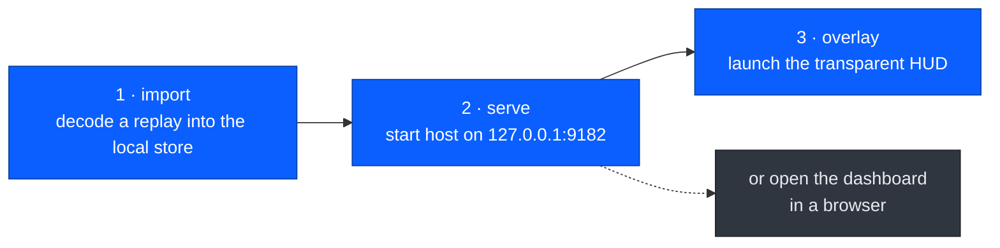
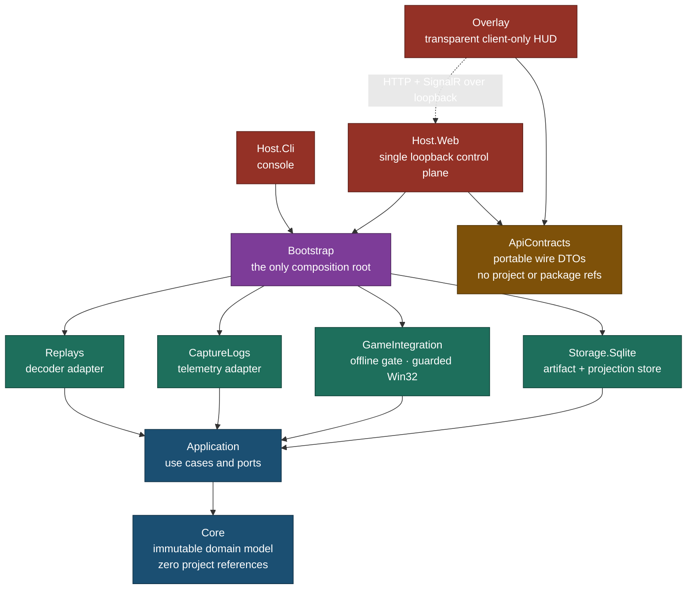

<div align="center">

# WotB Treader

**A Windows-first, offline-only replay telemetry reader for World of Tanks Blitz**

Decodes `.wotbreplay` evidence into immutable, versioned telemetry projections and
presents them through a loopback Blazor dashboard and a transparent WPF/WebView2 HUD.

[](https://github.com/360madden/wotb_reader/actions/workflows/ci.yml)
[](global.json)
[](#requirements)
[](LICENSE)

[](#test-matrix)
[](#quality-gate)
[](#-progress-to-completion)
[-D93F0B?style=flat-square&logo=shieldsdotio&logoColor=white)](#-safety-model)

[Quickstart](#-quickstart) · [Architecture](#-architecture) · [Progress](#-progress-to-completion) · [Safety](#-safety-model) · [Docs](#-documentation)

</div>

---

## 📖 Overview

WotB Treader reads replay files that the game has already written to disk. It never
touches a live match. Replay bytes are decoded into a content-addressed store, unknown
records are preserved rather than discarded, and every reprocess produces a **new
immutable decode run** instead of mutating an old one.

The result is served locally: an ASP.NET Core Blazor dashboard bound to loopback, and a
transparent, borderless, topmost HUD that overlays the game while it plays back a
pre-recorded replay — showing position plots and telemetry the built-in viewer does not
expose.

> [!NOTE]
> The project owner identifies as a junior developer at Wargaming.net. This is a
> personal, independently maintained project and carries no official status. See
> [Project context](docs/project-context.md).

**Not part of the runtime:** Python, Node.js, Rust, Electron, containers, cloud
services, runtime AI, or dynamic decoder DLLs.

---

## ✨ Capabilities

| | Surface | What it does |
|:--:|---|---|
| 🧩 | **Replay decoder** | `.wotbreplay` container, protobuf wire format, and pickle **as data only** — opcodes are never executed |
| 🗄️ | **Immutable store** | SQLite artifacts, decode runs, telemetry projections, and comparison runs with schema migrations |
| 📊 | **Loopback dashboard** | Blazor Web App on `127.0.0.1:9182` — sessions, participants, events, battle stats, comparisons, diagnostics |
| 🎯 | **Transparent HUD** | Borderless topmost WPF overlay: position plot, velocity trails, minimap grid, event feed, timeline scrubber |
| 📡 | **Live push** | SignalR stream keeps the HUD and dashboard current as new replays are imported |
| ⌨️ | **CLI** | `import`, `watch`, `inspect`, `reprocess`, `sessions`, `compare`, `export`, `doctor` |
| 📁 | **Auto-import** | Directory watcher with stability delay and idempotent ingestion |
| 🔍 | **Comparison engine** | Diff two decode runs field-by-field with exact / tolerant / mismatch classification |

---

## 🚀 Quickstart

### Requirements

| Component | Version |
|---|---|
|  | 10 or 11 |
|  | 10.0.302 (pinned by [`global.json`](global.json)) |
|  | Evergreen Runtime — only for the overlay's dashboard tab |

### Startup sequence

The HUD is a loopback **client** with no data of its own. It discovers the web host
through an owner-only rendezvous file, so order matters:



```powershell
.\import.cmd <path-to-replay>   # 1 · decode into .data\ (one-time per replay)
.\serve.cmd                     # 2 · publish + start the web host (keep running)
.\overlay.cmd                   # 3 · launch the HUD
```

Or launch the whole stack at once:

```powershell
.\everything.cmd                # starts serve + overlay in separate windows
```

Data lives in `.data\` and publish output in `.build\publish\`; both are gitignored.

### Convenience wrappers

Thirteen `.cmd` wrappers sit in the repository root and run from any directory.

| Wrapper | Purpose |
|---|---|
| `build` · `test` · `validate` | Build Release · run all tests · run the full quality gate |
| `serve` · `overlay` · `everything` | Start the web host · start the HUD · start both |
| `import <file>` | Import one `.wotbreplay` file |
| `watch <dir>` | Watch a directory and auto-import new replays |
| `sessions` · `doctor` | List decoded battle sessions · run environment health checks |
| `compare list \| inspect <id> \| create <left> <right>` | Manage comparison runs |
| `export sessions \| positions <id>` | Export events or position samples as JSON |
| `treader <cmd> [args]` | General CLI passthrough |

> [!TIP]
> `serve` is intentionally **not** a CLI verb. The web host is a separate executable so
> the CLI never takes a dependency on it; the two find each other via rendezvous.

### Keyboard shortcuts (HUD)

| Key | Action |
|:--:|---|
| <kbd>Space</kbd> | Play / pause |
| <kbd>←</kbd> / <kbd>→</kbd> | Scrub back / forward 5 seconds |
| <kbd>1</kbd> <kbd>2</kbd> <kbd>3</kbd> <kbd>4</kbd> <kbd>5</kbd> | Playback speed 0.5× / 1× / 2× / 4× / 8× |
| <kbd>Esc</kbd> | Close overlay |

---

## 🧱 Architecture

A modular monolith with mechanically enforced boundaries. Every arrow means
**"depends on"**; the dotted arrow is a versioned loopback protocol, not a project
reference.



### Enforced invariants

These are not conventions — `WotBTreader.Architecture.Tests` fails the build when any
of them is violated.

| | Invariant |
|:--:|---|
| 🟣 | `Core` has no project references; `Application` references only `Core` |
| 🟢 | Adapters never reference one another; they see only `Application` and `Core` |
| 🟠 | `ApiContracts` has zero project **and** zero package references — its lock file is empty |
| 🔴 | `Overlay` references only `ApiContracts`; it cannot parse replays, reach storage, or read memory |
| 🔵 | Only `Overlay` and `tools/GameHarness` may target `net10.0-windows`; everything else stays portable |
| ⚫ | No native interop or direct process-memory reader may appear in `Host.Web` or `GameHarness` |
| 🟡 | Every new DI port must be listed in `CompositionRootTests`, or no host will start |

Full design, evidence lifecycle, and trust boundary: [`docs/architecture/overview.md`](docs/architecture/overview.md).

---

## 📈 Progress to completion

Progress is tracked on two independent tracks. **Feature surfaces are largely built;
the architecture hardening plan is what actually gates the alpha release.** A feature
being implemented does not mean it satisfies the current trust-boundary and
offline-safety gates.

### Track 1 · Feature delivery

```
████████████████████████████████████░░░░  ~90%
```

All eight original roadmap items plus fifteen follow-on features shipped across the
2026-07-26 → 2026-07-28 sessions. Remaining: live HUD smoke test against a real
installation, and real minimap textures. Historical ledger: [`docs/ROADMAP.md`](docs/ROADMAP.md).

### Track 2 · Architecture hardening (release gate)

```
████████████░░░░░░░░░░░░░░░░░░░░░░░░░░░░  ~31%   (2 of 8 complete, M2 in progress)
```

| | Milestone | Status | Gate it closes |
|:--:|---|---|---|
| 🟢 | **M0** — Contain regressions, establish baseline | **Complete** | No host opens a memory-capable handle from a window alone; harness `scan`/`probe` hard-denied; owner-only rendezvous ACL verified |
| 🟢 | **M1** — Recover and enforce dependency boundaries | **Complete** | Portable TFMs restored; full reference graph mechanically enforced; `ApiContracts` owns every wire shape |
| 🟡 | **M2** — Centralize game access, enforce offline state | **In progress** | Fail-closed session boundary, query-only process observer, lifecycle evidence feed, trusted-executable identity, launch preparation barrier, replay staging lease, and pinned executable lease are all landed but deliberately **disconnected**. Process memory reads remain disabled |
| ⚪ | **M3** — One authenticated local control plane | Pending | Single mutation policy; capability-authenticated SignalR; no path-based launch |
| ⚪ | **M4** — Offset acquisition as an evidence subsystem | Pending | Offsets promoted only on agreeing static, dynamic, and harness evidence |
| ⚪ | **M5** — Restore the overlay to a focused HUD | Pending | No WebView2, Kestrel, parser, storage, or memory dependency in the HUD |
| ⚪ | **M6** — Process lifecycle and local operability | Pending | A standard user can run the packaged product without elevation or repo paths |
| ⚪ | **M7** — Architecture as a release gate | Pending | Clean checkout passes the full gate with synthetic fixtures only |

Sequencing is strict: **M0 → M1 → M2**, after which M3 and M4 may proceed in parallel.
No product memory integration or offset reliance may begin before M2 closes.

Full plan and per-milestone exit criteria: [`docs/architecture/roadmap.md`](docs/architecture/roadmap.md).

---

## 🔒 Safety model

This project runs against a game client, so the safety posture is deliberately
restrictive and **fails closed by default**.

| | Rule |
|:--:|---|
| 🚫 | **Offline only.** Pre-recorded replay playback is offline use. Matchmaking and live battles are never automated, inspected, or touched |
| 🔴 | **Process memory is currently disabled.** No `PROCESS_VM_READ`, `VM_WRITE`, or `VM_OPERATION` handle opens anywhere in the codebase; this is enforced by architecture tests |
| 🟠 | **Positive evidence required.** Before any future memory access: canonical executable path, version, SHA-256, PID with process-start identity, owned window, healthy monitor, confirmed replay UI, and a fresh lifecycle marker must all agree |
| ⚪ | **Unknown stays unknown.** Unrecognized records, versions, offsets, and participant kinds are reported as `unknown` — never guessed. Bot status is never inferred from a name |
| 🔇 | **Never logged.** Raw replay bytes, tokens, full paths, player names, account IDs, chat, and screenshots |
| 📌 | **Immutable evidence.** Source artifacts and decode runs are append-only; reprocessing creates a new run |
| 🛡️ | **Loopback ≠ authorization.** Unsafe local operations require an explicit owner-only capability, not merely a loopback source address |
| 🧊 | **The game install is read-only.** WotB files and game-derived assets are never modified or redistributed |

Rationale and decision records: [ADR 0002 — Evidence and offline safety](docs/decisions/0002-evidence-and-offline-safety.md).

---

## 🔧 Development

### Quality gate

One script is the authoritative gate. Run it before any milestone commit.

```powershell
.\scripts\validate.ps1                  # locked restore → format → build → test → scan
.\scripts\validate.ps1 -AuditPackages   # the above, plus transitive vulnerability audit
```

| Phase | What it enforces |
|---|---|
| 🔒 Restore | `--locked-mode` against committed lock files; `NuGetAuditMode=all` fails on vulnerable transitives |
| 🎨 Format | `dotnet format --verify-no-changes` |
| 🏗️ Build | Release with `TreatWarningsAsErrors` — warnings are errors, no exceptions |
| 🧪 Test | Full suite on MSTest 4 / Microsoft.Testing.Platform |
| 🔎 Scan | `scan-repository.ps1` — secret detection and ignore-policy enforcement |

Individual commands:

```powershell
dotnet restore WotBTreader.sln --locked-mode
dotnet build   WotBTreader.sln -c Release --no-restore
dotnet test    WotBTreader.sln -c Release --no-build
dotnet test    tests/WotBTreader.Core.Tests -c Release --filter "FullyQualifiedName~SomeTest"
```

### Test matrix

**395 passed · 2 skipped · 397 total · 0 warnings · 0 errors** across 12 test projects.
The two skips are installed-game tests that are local opt-in and never run in CI.

| Project | Tests | | Project | Tests |
|---|--:|:--:|---|--:|
| `GameIntegration.Tests` | 118 | | `Host.Cli.Tests` | 15 |
| `Overlay.Tests` | 91 | | `Architecture.Tests` | 14 |
| `Host.Web.Tests` | 61 | | `Bootstrap.Tests` | 13 |
| `GameHarness.Tests` | 28 | | `CaptureLogs.Tests` | 9 |
| `Replays.Tests` | 18 | | `Core.Tests` | 7 |
| `Storage.Sqlite.Tests` | 17 | | `Application.Tests` | 6 |

> [!IMPORTANT]
> CI runs on synthetic fixtures only. Private replays, captures, databases, and
> screenshots stay in ignored paths and are never committed. See
> [`docs/testing/fixture-policy.md`](docs/testing/fixture-policy.md).

---

## 📚 Documentation

| Document | Contents |
|---|---|
| [`knowledge.md`](knowledge.md) | Working quickstart, conventions, and the running gotcha list |
| [`AGENTS.md`](AGENTS.md) | Agent entry point: exact commands, hard constraints, delegation routing |
| [`docs/architecture/overview.md`](docs/architecture/overview.md) | Accepted design, HUD intent, evidence lifecycle, trust boundary |
| [`docs/architecture/roadmap.md`](docs/architecture/roadmap.md) | **Active** M0–M7 hardening plan with exit criteria |
| [`docs/ROADMAP.md`](docs/ROADMAP.md) | Historical feature-delivery ledger |
| [`docs/decisions/`](docs/decisions/) | ADRs — modular monolith, evidence and offline safety |
| [`docs/operations/blocker-log.md`](docs/operations/blocker-log.md) | Immutable blocker record (BLK-0001 … BLK-0015) |
| [`docs/operations/handoffs/`](docs/operations/handoffs/) | Append-only session handoffs |
| [`docs/testing/fixture-policy.md`](docs/testing/fixture-policy.md) | Fixture sanitization rules |
| [`docs/formats/`](docs/formats/) | Telemetry capture NDJSON v1 format |

---

## 📜 License and third-party material

Project source is [MIT licensed](LICENSE), copyright WotB Treader contributors.

Replay fixtures, Wargaming-derived resources, user data, and separately licensed
third-party material are **excluded** from that grant. See
[THIRD-PARTY-NOTICES.md](THIRD-PARTY-NOTICES.md).

<div align="center">

<sub>World of Tanks Blitz is a trademark of Wargaming.net. This project is not affiliated with, endorsed by, or sponsored by Wargaming.net.</sub>

</div>
