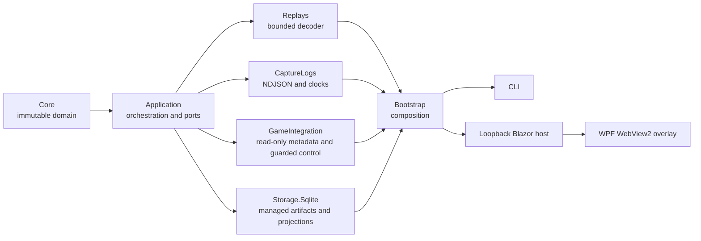

# Architecture overview

Status: accepted for alpha — all surfaces implemented

Last updated: 2026-07-27

WotB Treader is a Windows-first .NET 10 modular monolith. It separates evidence
acquisition from interpretation so a newer decoder can reprocess the same
immutable source without overwriting prior results.

The arrow denotes a dependency. `Core` has none. The overlay is intentionally
outside parser and storage internals and consumes only the loopback web
contract.

## Overlay / HUD design intent

The overlay is a **transparent, borderless, always-on-top WPF window** designed
to sit on top of the WoT Blitz game while the game plays back a pre-recorded
replay. The overlay shows decoded telemetry — position scatter plots coloured by
team, session metadata, and the embedded Blazor dashboard — that the game's
built-in replay viewer does not expose.

### Why this matters: the game's minimap lies

WoT Blitz's built-in replay viewer only shows **spotted** tanks on the minimap.
Enemy tanks that were not spotted during the original match are invisible. The
`.wotbreplay` file, however, contains the **full position history of every tank**
in the battle — spotted or not. WotB Treader decodes all of this data offline.

The HUD overlays the *complete* position plot on top of the game, revealing
unspotted enemy movements, flanking routes, and positioning mistakes that the
game's replay viewer intentionally hides. This is the product's core value
proposition.

### Window properties (implemented ✅)

The `MainWindow.xaml` now uses:

- `WindowStyle="None"` — no title bar or chrome
- `AllowsTransparency="True"` — transparent background outside the HUD panel
- `Background="Transparent"` — see-through to the game underneath
- `Topmost="True"` — stays above the game window
- `MouseLeftButtonDown` → `DragMove()` — draggable without a title bar

A floating semi-transparent dark panel (`#CC111111`) on the right side contains
Launch, Refresh, Dashboard, Close buttons, and a session list. The
`PositionPlot` canvas spans the full window behind the panel.

### Game window tracking (implemented ✅)

P/Invoke `FindWindowW`/`GetWindowRect`/`SetWindowPos` with a 500ms
`DispatcherTimer` (`_windowTrackTimer`). When the "World of Tanks Blitz"
game window is found, the overlay repositions itself to match its bounds.
The timer starts when the Launch button triggers game playback.

### Game launch mechanism (implemented ✅)

The Launch button calls `LaunchGameWithSelectedReplay`:
1. Finds the most recently modified `.wotbreplay` in the Blitz replay folder
   (`%LOCALAPPDATA%\wotblitz\DAVAProject\replays\`)
2. Copies it to the replay folder (if not already there)
3. Launches `wotblitz.exe` with the replay file as a command-line argument
4. Starts the window tracking timer

The game path is currently hardcoded to `C:\Games\World_of_Tanks_Blitz\wotblitz.exe`.
**FUTURE:** Use `GameInstallationDiscovery` to auto-discover the install path.

### Known architectural constraint: WebView2 + transparency

**`AllowsTransparency="True"` is incompatible with WebView2.** When a WPF window
enables layered-window transparency, WPF switches to GDI-based compositing
(instead of hardware-accelerated DirectX). WebView2 uses a hidden child HWND
for rendering, which the layered-window compositor cannot composite correctly —
the WebView content disappears, flickers, or fails to receive input.

This means the embedded Blazor dashboard **cannot coexist** with a transparent
overlay window. Design options:

1. **Two windows**: A transparent HUD window for the position plot + a separate
   opaque window for the dashboard (or use the browser).
2. **No WebView2 in the HUD**: Remove the dashboard tab from the transparent
   overlay. Users open `http://127.0.0.1:9182` in a browser for deep inspection.
3. **Binary transparency via `TransparencyKey`**: Use a chroma-key colour
   (e.g. magenta) as the transparent colour instead of alpha blending. This
   avoids `AllowsTransparency` and keeps WebView2 working, but limits
   transparency to on/off (no semi-transparent HUD panel).

### Coordinate space and map boundaries

Positions are decoded in `CoordinateSpace.ReplayRaw` — raw engine units from
the replay file. The `PlotTransform` maps these to canvas coordinates via
min/max fitting across all points, falling back to known map boundaries.

Map boundary data (`WorldMinX`/`MaxX`/`MinZ`/`MaxZ`) is fetched from the
`/api/v1/maps/boundaries` endpoint and applied via `MainViewModel.ApplyMapBoundaries()`.
When boundaries are available for a map, positions are normalised against the
full map extent for stable minimap projection regardless of which area of the
map a particular battle covered.

The community computes boundaries by observing extreme positions across
thousands of replays. When boundaries are unavailable, `PlotTransform` falls
back to per-session min/max fitting.

### Overlay analysis features (all implemented)

Beyond position plotting, the overlay sidebar provides a full replay analysis
cockpit:

| Feature | Implementation |
|---------|---------------|
| Position scatter plot | `FastPlotRenderer` — DrawingVisual-based, zero-GC rendering with frozen brushes/pens |
| Velocity trails | Fading polylines per participant, opacity 0.12→0.85 oldest-to-newest |
| Minimap reference grid | Dashed grid lines + map name label on `BackgroundCanvas` |
| Event feed | Chronological event list with damage summaries; click to scrub timeline |
| Battle stats | Damage taken + kills per team, computed from Destroyed/Damage events |
| Time-slider scrubber | Play/pause, cumulative position playback, loop mode |
| Playback speed | Cycle 0.5×/1×/2×/4×/8×; keyboard shortcuts 1-5 |
| Session search/filter | Case-insensitive map name filter in the sidebar |
| Collapsible sidebar | Shrink to controls-only strip via « button |
| Sidebar opacity | Cycle 85%→50%→20% transparency via 👁 button |
| Keyboard shortcuts | Space=play/pause, ←→=scrub ±5s, 1-5=speed, Esc=close |
| Game window tracking | P/Invoke FindWindowW/SetWindowPos; overlay follows WoT Blitz window |

### What the overlay is NOT

- It is NOT a generic session viewer. The web dashboard at `http://127.0.0.1:9182`
  serves that purpose for deep inspection.
- It is NOT a replacement for the game's built-in replay viewer. It augments it.
- It is NOT a live-game overlay. It only works with pre-recorded replay playback.

## Evidence lifecycle

1. An input is probed with bounded reads.
2. The complete input is copied atomically into a SHA-256 content-addressed
   store under the user's local application data.
3. SQLite records the immutable source artifact and creates a new decode run.
4. A version-selected decoder records raw ranges, canonical events, capability
   claims, warnings, and unresolved semantics in one transaction.
5. Events become visible to real-time clients only after that transaction
   commits.
6. Reprocessing creates a new run; comparisons retain references to both
   immutable inputs.

SQLite stores metadata, indexes, projections, hashes, and byte ranges. It does
not duplicate multi-megabyte source payloads.

## WoT Blitz replay domain knowledge

The `.wotbreplay` file is a proprietary binary replay scenario, **not a video**.
It contains serialized game events (positions, shots, damage, chat) that the
game engine replays in real-time. Key facts any agent working on this project
must know:

- **File location:** `%LOCALAPPDATA%\wotblitz\DAVAProject\replays\` (PC version).
  The game auto-saves up to 100 recent replays; favourited replays are kept.
- **Launching replay playback:** Dragging a `.wotbreplay` file onto
  `wotblitz.exe` (or passing it as a command-line argument) launches the game
  directly into replay playback. Example:
  `Process.Start(@"C:\Games\World_of_Tanks_Blitz\wotblitz.exe", replayPath);`
- **Version dependency:** Replays only work with the exact game version they
  were recorded in. A 11.18.0.7 replay cannot be played on 11.19.
- **Playback controls:** Play/pause, timeline slider (seek forward only —
  **no rewind**), free camera (toggle with `C` key), speed controls.
- **Minimap visibility:** The game's replay minimap only shows tanks that were
  **spotted** at each moment — identical to the live-match minimap. Unspotted
  enemies are invisible.
- **Full position data:** Despite the minimap limitation, the `.wotbreplay`
  file records positions for **all 14 tanks throughout the entire battle**.
  This is the data WotB Treader decodes and the HUD displays.
- **No rewind:** There is no reverse playback. The timeline slider can seek
  forward to any point but cannot go backward.
- **Replay format internals:** The file is a ZIP archive containing
  version-specific protobuf and pickle-encoded sections. See
  `ReplayFormatConstants.cs`, `WotbReplayDecoder.cs`, and
  `RestrictedPickleReader.cs` for the decoder implementation.

## Compatibility boundary

The first strict decoder targets WotB `11.18.0.7`. Other builds may be imported
and preserved, but their semantics remain unsupported until an explicitly
registered decoder claims them. There are no dynamic in-process decoder DLLs.
A future external decoder can use a versioned, bounded NDJSON protocol.

## Local trust boundary

The web host binds only to loopback and rejects non-local host/origin requests.
Mutations require antiforgery and a short-lived local session capability.
Overlay and CLI discovery uses a short-lived rendezvous file with owner-only
permissions. No cloud or remote-control path is part of the alpha.
