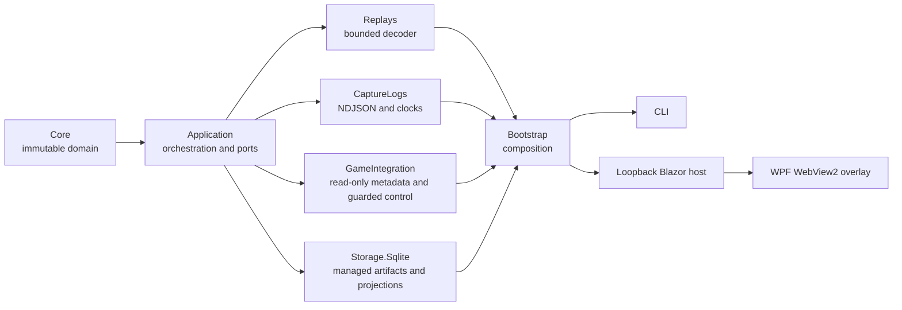

# Architecture overview

Status: accepted for alpha

Last updated: 2026-07-26

WotB Treader is a Windows-first .NET 10 modular monolith. It separates evidence
acquisition from interpretation so a newer decoder can reprocess the same
immutable source without overwriting prior results.

The arrow denotes a dependency. `Core` has none. The overlay is intentionally
outside parser and storage internals and consumes only the loopback web
contract.

## Evidence lifecycle

1. An input is probed with bounded reads.
2. The complete input is copied atomically into a SHA-256 content-addressed
   store under the user's local application data.
3. SQLite records the immutable source artifact and creates a new decode run.
4. A version-selected decoder records raw ranges, canonical events, capability
   claims, warnings, and unresolved semantics in one transaction.
5. Events become visible to real-time clients only after that transaction
   commits.
6. Reprocessing creates a new run; comparisons retain references to both
   immutable inputs.

SQLite stores metadata, indexes, projections, hashes, and byte ranges. It does
not duplicate multi-megabyte source payloads.

## Compatibility boundary

The first strict decoder targets WotB `11.18.0.7`. Other builds may be imported
and preserved, but their semantics remain unsupported until an explicitly
registered decoder claims them. There are no dynamic in-process decoder DLLs.
A future external decoder can use a versioned, bounded NDJSON protocol.

## Local trust boundary

The web host binds only to loopback and rejects non-local host/origin requests.
Mutations require antiforgery and a short-lived local session capability.
Overlay and CLI discovery uses a short-lived rendezvous file with owner-only
permissions. No cloud or remote-control path is part of the alpha.
