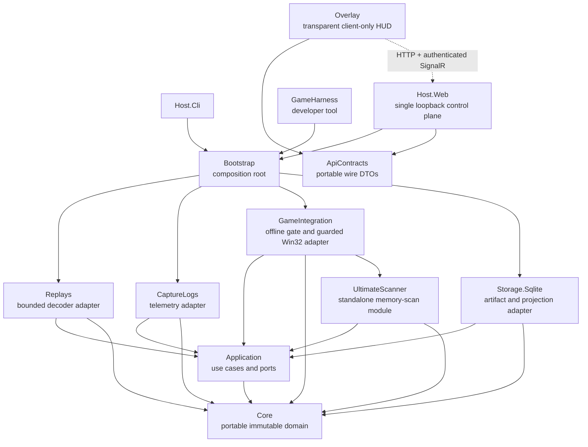

# Architecture overview

Status: accepted alpha architecture — hardening milestones complete

Last updated: 2026-08-15

The project owner identifies as a junior developer at Wargaming.net. This is
a personal, independently maintained project; see
[Project context](../project-context.md).

Implementation and hardening sequence:
[`roadmap.md`](roadmap.md). The roadmap records known deltas between this
accepted design and the current code; its milestone exit criteria govern when a
surface is considered architecture-complete.

WotB Treader is a Windows-first .NET 10 modular monolith. It separates evidence
acquisition from interpretation so a newer decoder can reprocess the same
immutable source without overwriting prior results.

The arrow denotes a compile-time dependency; the dotted arrow is a versioned
loopback protocol. `Core` has none. `Bootstrap` is the only composition root.
`GameIntegration` owns game discovery, log monitoring, replay launching,
offline verification, and guarded Win32 access, and delegates memory scanning
to the standalone `UltimateScanner` module (multi-scan engine,
pattern/neighborhood scans, and the guarded VM reader). The overlay is
outside parser, storage, application, domain, host, and adapter internals and
consumes only the portable wire contract.

Only the `Overlay` and `GameHarness` production surfaces and their corresponding
test projects may target `net10.0-windows`; every other project targets portable
`net10.0`. Milestone 1 is
complete: the target-framework allowlist, the production reference graph, and the
no-dependency `ApiContracts` project are all in place and mechanically enforced by
`WotBTreader.Architecture.Tests`.

## Overlay / HUD design intent

The overlay is a **transparent, borderless, always-on-top WPF window** designed
to sit on top of the WoT Blitz game while the game plays back a pre-recorded
replay. The overlay shows decoded telemetry — position scatter plots coloured by
team, session metadata, and replay controls — that the game's built-in replay
viewer does not expose. Deep inspection remains in the system browser at the
loopback dashboard.

### Single local control plane

`Host.Web` is the only HTTP control plane. The legacy overlay Kestrel listener on
port 9190 no longer starts — it was removed in Milestone 0 and
`OverlayControlPlaneContainmentTests` keeps it removed. Nothing binds that port, and
the former endpoint/state implementation has been deleted. The overlay must not grow
a second control plane; all HTTP and SignalR operations go through `Host.Web`.

Browser mutations use same-origin validation, antiforgery, and a short-lived
capability. Native overlay and CLI mutations use the owner-only rendezvous
capability without ambient cookies or browser antiforgery. Both profiles are
enforced by one Host.Web mutation component. Loopback source IP alone is never
authorization.

### Why this matters: the game's minimap lies

WoT Blitz's built-in replay viewer only shows **spotted** tanks on the minimap.
Enemy tanks that were not spotted during the original match are invisible. The
`.wotbreplay` file, however, contains the **full position history of every tank**
in the battle — spotted or not. WotB Treader decodes all of this data offline.

The HUD overlays the *complete* position plot on top of the game, revealing
unspotted enemy movements, flanking routes, and positioning mistakes that the
game's replay viewer intentionally hides. This is the product's core value
proposition.

### Window properties (implemented ✅)

The `MainWindow.xaml` now uses:

- `WindowStyle="None"` — no title bar or chrome
- `AllowsTransparency="True"` — transparent background outside the HUD panel
- `Background="Transparent"` — see-through to the game underneath
- `Topmost="True"` — stays above the game window
- `MouseLeftButtonDown` → `DragMove()` — draggable without a title bar

A floating semi-transparent dark panel (`#CC111111`) on the right side contains
Launch, Refresh, Dashboard, Close buttons, and a session list. The
`PositionPlot` canvas spans the full window behind the panel.

### Game window tracking (implemented ✅)

The tracker polls the visible top-level window of the `wotblitz.exe` process
with `GetWindowRect`/`SetWindowPos` on a 500ms `DispatcherTimer`
(`_windowTrackTimer`). It deliberately does not require one exact caption: the
installed client currently reports `WoT Blitz`, while older builds reported
`World of Tanks Blitz`. A visible game process with zero or multiple eligible
windows remains fail-closed rather than selecting an arbitrary window. Minimized
or splash-sized bounds below 320×200 are also rejected until a usable game
surface exists.
The timer starts in the `MainWindow` constructor and runs for the window's
lifetime, so tracking works regardless of how the game was started; it stops on
dispose. Tracking is window-geometry only and opens no process handle.

The diagnostics banner also exposes an explicit game-window alignment state:
waiting for the target window, aligned, bounds unavailable, invalid bounds, or
alignment failed. The overlay only reports `aligned` after `GetWindowRect` and
`SetWindowPos` both succeed, so a visible HUD is not mistaken for a correctly
positioned HUD. Missing-window polling is recorded through the rate-limited
privacy-safe HUD logger.

The same banner reports wall-clock frame age, last refresh latency, and counts
of rendered nameplates, minimap dots, and beacons. These diagnostics are
presentation-only and refresh on the existing sidebar timer; they never expose
raw replay values or memory addresses. The timer does not re-fetch decoded
replay details: those projections are immutable after import, so playback is
not reset or interrupted by background diagnostics work. Manual Refresh and
SignalR session-list updates remain the explicit refresh paths.

### HUD UI versioning

The WPF presentation surface carries an independent semantic version, currently
**HUD UI v0.6.0-alpha**. The version is shown in the overlay sidebar and tracks
visible layout, rendering, and interaction changes only. It is intentionally
separate from the product version (`0.2.0-alpha`), the penetration feature
version (`v0.3`), and the loopback/API contract versions.

Versioning rules:

- **MAJOR**: incompatible HUD interaction or rendering-contract change;
- **MINOR**: additive HUD capability or visible surface;
- **PATCH**: visual, accessibility, or correctness fix without a new surface;
- **alpha**: the HUD is operationally testable but still subject to evidence-
  gated product limitations and manual visual-smoke requirements.

The displayed version must be bumped with the same change that alters the HUD
surface, so screenshots, smoke-test notes, and user reports can identify the
presentation build without exposing private paths or runtime data.

### HUD runtime state and diagnostics

The sidebar exposes a fail-closed runtime state banner rather than relying on a
single free-form status string. `MainViewModel.RuntimeState` is an explicit
state machine covering startup, host discovery, no-session/no-data, replay
loading/ready/paused/playing, stale-frame retention, live loading/ready/
unavailable, and fatal startup failure. The banner also shows a safe detail
message and a frame marker such as `No replay frame received`, `Frame @ 120.0s`,
or `Last replay frame retained`.

State transitions preserve the existing data-safety rules:

- no host or invalid/stale rendezvous never presents session data;
- changing sessions or replay/live mode clears frame-derived collections before
  a new request can publish;
- a failed refresh may retain a last-good frame, but the banner explicitly
  marks it stale rather than presenting it as current;
- malformed or unavailable live frames show `Live unavailable` and clear the
  penetration verdict; and
- startup exceptions enter `FatalError` with only a safe exception type shown
  to the user.

The banner is presentation-only. It does not add a control plane, expose
capability tokens, or change the shared API contract.

The session list also has explicit empty-state copy. It distinguishes a host
that has returned no replay sessions from a map filter that matches nothing,
and provides the next safe user action instead of leaving a blank list.

### HUD logging

The standalone WPF process initializes its own structured HUD logger because it
is intentionally outside the `Bootstrap` host composition root. It writes
privacy-safe JSON-lines records to the user's local application-data `logs`
directory as `hud-YYYYMMDD.jsonl`, rolling at 20 MiB and retaining at most 14
files. A numeric suffix is used when a day's file reaches the size limit.

The logger records process/window lifecycle, rendezvous and host availability,
session/detail loads, frame outcomes, SignalR lifecycle, live-observation
availability, dashboard actions, and unhandled failures. It records event
names, modes, counts, booleans, dimensions, and exception type names only. It
does not write exception messages or stacks, capability tokens, URLs/query
strings, paths, session/account/artifact identifiers, player telemetry values,
or arbitrary object graphs. Sensitive property names are redacted as a second
boundary even if a future caller accidentally supplies one.

Frame, memory, stream, and polling events are rate-limited to one record per
five seconds per event name. The next admitted record carries a bounded
`suppressedCount` so a high-frequency failure or stale-frame pattern remains
diagnosable without turning a 20 fps HUD into an unbounded log writer. If the
log directory or sink fails, logging disables itself and the HUD continues
running; diagnostics must never become a new startup dependency.

The toolbar's diagnostics export writes a bounded JSON document containing the
safe HUD state and aggregated event names/counts/timestamps from up to 14 local
HUD log files. It does not copy raw log properties, replay data, paths, URLs,
identifiers, or credentials, and export failures remain visible without
exposing exception text.

### Game launch mechanism

The overlay has no game-launch authority. It requests a launch through the
authenticated Host.Web control plane. The accepted target resolves a managed
artifact or session identifier server-side, stages without overwriting user
files, and launches only through the positively verified game executable.
`GameIntegration` owns the discovery and launch implementation behind
application ports. Plain game starts set the executable directory as the
working directory so the installed client's relative WGC/native dependencies
resolve even when the host was started elsewhere. Caller-supplied full paths,
hardcoded installation paths, and unverified shell-handler fallbacks are not
part of the target.

### Historical implementation delta: WebView2 + transparency

**`AllowsTransparency="True"` is incompatible with WebView2.** When a WPF window
enables layered-window transparency, WPF switches to GDI-based compositing
(instead of hardware-accelerated DirectX). WebView2 uses a hidden child HWND
for rendering, which the layered-window compositor cannot composite correctly —
the WebView content disappears, flickers, or fails to receive input.

This means an embedded Blazor dashboard **cannot coexist** reliably with a
transparent overlay window. Milestone 5 removed WebView2 from the HUD path; the
current HUD opens deep inspection in the system browser. WebView2 is historical
context only and is not a current runtime dependency.

### Coordinate space and map boundaries

Positions are decoded in `CoordinateSpace.ReplayRaw` — raw engine units from
the replay file. The `PlotTransform` maps these to canvas coordinates via
min/max fitting across all points, falling back to known map boundaries.

Map boundary data (`WorldMinX`/`MaxX`/`MinZ`/`MaxZ`) is fetched from the
`/api/v1/maps/boundaries` endpoint and applied via `MainViewModel.ApplyMapBoundaries()`.
When boundaries are available for a map, positions are normalised against the
full map extent for stable minimap projection regardless of which area of the
map a particular battle covered.

Decoded numeric arena IDs are resolved through the exact-build installed map
metadata before a texture is selected. `MapMetadata.SceneResourcePath`
preserves the relative `maps.yaml.dvpl` `localName`; `MinimapTextureService`
reduces that trusted scene path to one validated name-based minimap folder,
preserving numeric variants such as `desert_train_02`. Unknown numeric IDs and
invalid folder components fail closed to the dots-only panel.

The community computes boundaries by observing extreme positions across
thousands of replays. When boundaries are unavailable, `PlotTransform` falls
back to per-session min/max fitting.

### Overlay analysis features (all implemented)

Beyond position plotting, the overlay sidebar provides a full replay analysis
cockpit:

| Feature | Implementation |
|---------|---------------|
| Position scatter plot | `FastPlotRenderer` — DrawingVisual-based, zero-GC rendering with frozen brushes/pens |
| Velocity trails | Fading polylines per participant, opacity 0.12→0.85 oldest-to-newest |
| Minimap reference grid | Dashed grid lines + map name label on `BackgroundCanvas` |
| Event feed | Chronological event list with damage summaries; click to scrub timeline |
| Battle stats | Damage taken + kills per team, computed from Destroyed/Damage events |
| Time-slider scrubber | Play/pause, cumulative position playback, loop mode |
| Playback speed | Cycle 0.5×/1×/2×/4×/8×; keyboard shortcuts 1-5 |
| Session search/filter | Case-insensitive map name filter in the sidebar |
| Collapsible sidebar | Shrink to controls-only strip via « button |
| Sidebar opacity | Cycle 85%→50%→20% transparency via 👁 button |
| Keyboard shortcuts | Space=play/pause, ←→=scrub ±5s, 1-5=speed, Esc=close |
| Game window tracking | Injectable Win32 seam; explicit alignment state and rate-limited diagnostics |
| Render health | Frame age, refresh latency, and rendered collection counts in the diagnostics banner |
| Diagnostics export | Bounded privacy-safe JSON summary from the toolbar |

### What the overlay is NOT

- It is NOT a generic session viewer. The web dashboard at `http://127.0.0.1:9182`
  serves that purpose for deep inspection.
- It is NOT a replacement for the game's built-in replay viewer. It augments it.
- It is NOT a live-game overlay. It only works with pre-recorded replay playback.

## Evidence lifecycle

1. The complete input is copied atomically into a SHA-256 content-addressed
   store under the user's local application data.
2. The managed immutable copy is probed with bounded reads.
3. SQLite records the immutable source artifact and creates a new decode run.
4. A version-selected decoder records raw ranges, canonical events, capability
   claims, warnings, and unresolved semantics in one transaction.
5. Events become visible to real-time clients only after that transaction
   commits.
6. Reprocessing creates a new run; comparisons retain references to both
   immutable inputs.

SQLite stores metadata, indexes, projections, hashes, and byte ranges. It does
not duplicate multi-megabyte source payloads.

## WoT Blitz replay domain knowledge

The `.wotbreplay` file is a proprietary binary replay scenario, **not a video**.
It contains serialized game events (positions, shots, damage, chat) that the
game engine replays in real-time. Key facts any agent working on this project
must know:

- **File location:** `%LOCALAPPDATA%\wotblitz\DAVAProject\replays\` (PC version).
  The game auto-saves up to 100 recent replays; favourited replays are kept.
- **Launching replay playback:** Dragging a `.wotbreplay` file onto
  `wotblitz.exe` (or passing it as a command-line argument) launches the game
  directly into replay playback. Example:
  `Process.Start(@"C:\Games\World_of_Tanks_Blitz\wotblitz.exe", replayPath);`
- **Version dependency:** Replays only work with the exact game version they
  were recorded in. A 11.18.0.7 replay cannot be played on 11.19.
- **Playback controls:** Play/pause, timeline slider (seek forward only —
  **no rewind**), free camera (toggle with `C` key), speed controls.
- **Minimap visibility:** The game's replay minimap only shows tanks that were
  **spotted** at each moment — identical to the live-match minimap. Unspotted
  enemies are invisible.
- **Full position data:** Despite the minimap limitation, the `.wotbreplay`
  file records positions for **all 14 tanks throughout the entire battle**.
  This is the data WotB Treader decodes and the HUD displays.
- **No rewind:** There is no reverse playback. The timeline slider can seek
  forward to any point but cannot go backward.
- **Replay format internals:** The file is a ZIP archive containing
  version-specific protobuf and pickle-encoded sections. See
  `ReplayFormatConstants.cs`, `WotbReplayDecoder.cs`, and
  `RestrictedPickleReader.cs` for the decoder implementation.

## Compatibility boundary

The strict decoder accepts normalized WotB `11.18.0` and `11.19.0` replay
versions, including `11.18.0.7` and `11.19.0.10`. Other builds may be imported and
preserved, but their semantics remain unsupported until an explicitly registered
decoder claims them. There are no dynamic in-process decoder DLLs.
A future external decoder can use a versioned, bounded NDJSON protocol.

## Local trust boundary

The web host binds only to loopback and rejects non-local host/origin requests.
Mutations require antiforgery and a short-lived local session capability.
Overlay and CLI discovery uses a short-lived rendezvous file with owner-only
permissions. No cloud or remote-control path is part of the alpha.
