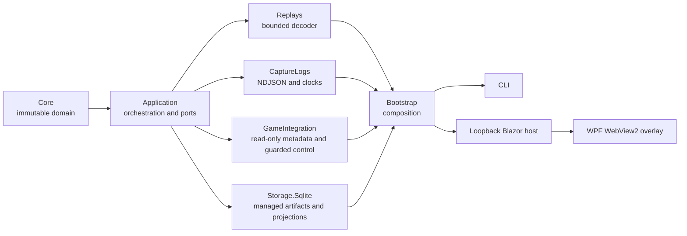

# Architecture overview

Status: accepted for alpha — all surfaces implemented

Last updated: 2026-07-27

WotB Treader is a Windows-first .NET 10 modular monolith. It separates evidence
acquisition from interpretation so a newer decoder can reprocess the same
immutable source without overwriting prior results.



The arrow denotes a dependency. `Core` has none. The overlay is intentionally
outside parser and storage internals and consumes only the loopback web
contract.

## Overlay / HUD design intent

The overlay is a **transparent, borderless, always-on-top WPF window** designed
to sit on top of the WoT Blitz game while the game plays back a pre-recorded
replay. The overlay shows decoded telemetry — position scatter plots coloured by
team, session metadata, and the embedded Blazor dashboard — that the game's
built-in replay viewer does not expose.

This is the core purpose of the overlay. It is not a generic session browser or
a replacement for the web dashboard. It is a heads-up display (HUD) that
**augments the game's replay playback** with data decoded offline from the
`.wotbreplay` file.

### Required window properties (NOT YET IMPLEMENTED)

- `WindowStyle="None"` — no title bar or chrome
- `AllowsTransparency="True"` — transparent background outside the HUD panel
- `Background="Transparent"` — see-through to the game underneath
- `Topmost="True"` — stays above the game window
- Draggable via mouse-down (no title bar to grab)

### Current state

The overlay is currently implemented as a standard opaque WPF window with a
toolbar and TabControl. The transparency and game-window positioning are
**not yet implemented**. The `MainWindow.xaml.cs` class comment describes the
intended transparent shell, but the XAML and code-behind have not been updated
to match.

### Game window integration (NOT YET IMPLEMENTED)

The overlay must track the game window position via P/Invoke
(`FindWindow`, `GetWindowRect`, `SetWindowPos`) and reposition itself to match
the game window's size and location. This ensures the position plot overlays
the game's minimap area correctly.

### Game launch mechanism (NOT YET IMPLEMENTED)

Dragging a `.wotbreplay` file onto `wotblitz.exe` (or passing it as a
command-line argument) launches the game directly into replay playback.
The overlay can trigger this by calling:

```csharp
Process.Start(@"C:\Games\World_of_Tanks_Blitz\wotblitz.exe", replayPath);
```

The exact game path should be discovered via `GameInstallationDiscovery`
rather than hardcoded.

### What the overlay is NOT

- It is NOT a generic session viewer. The web dashboard at `http://127.0.0.1:9182`
  serves that purpose for deep inspection.
- It is NOT a replacement for the game's built-in replay viewer. It augments it.

## Evidence lifecycle

1. An input is probed with bounded reads.
2. The complete input is copied atomically into a SHA-256 content-addressed
   store under the user's local application data.
3. SQLite records the immutable source artifact and creates a new decode run.
4. A version-selected decoder records raw ranges, canonical events, capability
   claims, warnings, and unresolved semantics in one transaction.
5. Events become visible to real-time clients only after that transaction
   commits.
6. Reprocessing creates a new run; comparisons retain references to both
   immutable inputs.

SQLite stores metadata, indexes, projections, hashes, and byte ranges. It does
not duplicate multi-megabyte source payloads.

## Compatibility boundary

The first strict decoder targets WotB `11.18.0.7`. Other builds may be imported
and preserved, but their semantics remain unsupported until an explicitly
registered decoder claims them. There are no dynamic in-process decoder DLLs.
A future external decoder can use a versioned, bounded NDJSON protocol.

## Local trust boundary

The web host binds only to loopback and rejects non-local host/origin requests.
Mutations require antiforgery and a short-lived local session capability.
Overlay and CLI discovery uses a short-lived rendezvous file with owner-only
permissions. No cloud or remote-control path is part of the alpha.
