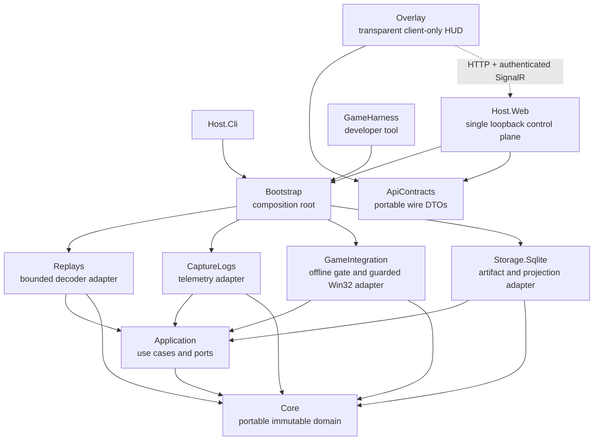
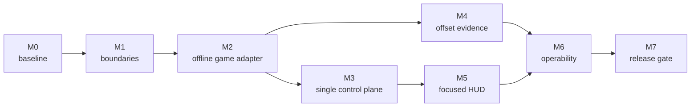

# Architecture roadmap

Status: active execution plan for the accepted alpha architecture and ADRs

Last updated: 2026-07-30

## Milestone status

| Milestone | Status |
|---|---|
| M0 — Contain regressions and establish a baseline | ✅ Complete |
| M1 — Recover and enforce dependency boundaries | ✅ Complete |
| M2 — Centralize game-process access and enforce offline state | ✅ Complete |
| M3 — Establish one authenticated local control plane | ✅ Complete |
| M4 — Make offset acquisition an evidence subsystem | ✅ Complete |
| M5 — Restore the overlay to a focused HUD | ✅ Complete |
| M6 — Clarify process lifecycle and local operability | ✅ Complete |
| M7 — Make architecture a release gate | ✅ Complete |

M2 completed with suspended process creation, identity verification, correlation
registrar, thread-resume platform, and guarded VM-read factory. M3 established the
single authenticated control plane with capability-based mutation policy. M4 added
offset evidence models, version/hash enforcement, publication separation, and orphan
reconciliation. M5 removed WebView2, host startup, game launch, and import authority
from the overlay — it is now a pure rendering/input/window-tracking loopback client.
M6 added port conflict detection, orphaned host process detection, and rendezvous
cleanup on shutdown. M7 updated the roadmap and ran the vulnerability audit.

All seven milestones are complete. The alpha architecture is enforced.

The project owner identifies as a junior developer at Wargaming.net. This is
a personal, independently maintained project; see
[Project context](../project-context.md).

This roadmap turns the accepted alpha architecture into an enforced,
release-ready structure. It prioritizes safety and dependency recovery before
new replay-offset work.

## Outcome

The target is a Windows-first modular monolith in which:

- `Core` remains a pure, portable domain model.
- `Application` owns use cases and ports, and references only `Core`.
- Adapters implement ports without referencing one another.
- `GameIntegration` owns all game discovery, log monitoring, replay launching,
  guarded Win32 access, and offline-session verification.
- `Bootstrap` is the only composition root.
- A portable `ApiContracts` assembly contains versioned loopback wire DTOs and
  has no project references.
- `Host.Web` is the single loopback control plane and remains portable
  `net10.0`.
- `Overlay` is a transparent, Windows-only HUD and loopback client. It does not
  parse replays, access storage, read game memory, or host a second control
  plane.
- `GameHarness` is a Windows-only developer tool that consumes the same
  application ports and game-integration implementations as the product.
- Ghidra and Cheat Engine are development-time evidence tools. Their raw
  projects, scans, dumps, and pointer maps remain local.

## Offline verification contract

“Offline” describes the active game session, not whether the game executable is
running or whether it has ancillary network connections. Playback of a
pre-recorded `.wotbreplay` is offline use. Matchmaking and live battles are not.

The automated gate builds on `HarnessSafetyPolicy` and ADR 0002. A verified
observation contains:

- the expected canonical executable path, version, and SHA-256;
- the observed PID and owned game window;
- compatible game/tool integrity levels;
- a fresh `OfflineReplayStarted` marker from `blitz-native-log`, no more than
  15 seconds old;
- the same PID and non-empty launch correlation on the lifecycle evidence; and
- foreground-window and explicit short-lived arming evidence when sending
  input.

Process enumeration and a short-lived query-only handle may be used to collect
identity evidence. No handle granting `PROCESS_VM_READ`, `PROCESS_VM_WRITE`, or
`PROCESS_VM_OPERATION` may open until the complete gate passes. The gate is
re-evaluated during long operations and denies immediately on stop evidence,
staleness, monitor failure, process exit, PID reuse, or identity conflict.
The initial marker admits a short-lived authorized-observation lease. The
session verifier may renew that lease only while log reconciliation remains
healthy and the same PID, executable identity, launch correlation, replay UI,
and lifecycle state continue to agree; low-level readers receive the lease
rather than a raw PID.

Before Milestone 2 automates this contract, manual process inspection with
Cheat Engine or scanner tooling is allowed only after the operator starts a
known pre-recorded replay, observes a fresh native `START_REPLAY_LOCAL` marker
within 15 seconds, binds the marker to the selected PID/window and verified
executable identity, confirms the replay playback UI, and records the
version/hash used. The operator stops inspection as soon as replay playback
ends, the process identity changes, or evidence becomes uncertain. Static
Ghidra analysis does not attach to a running process and may proceed
independently.

## Non-negotiable invariants

1. No live-match automation or memory inspection. Running the game to play a
   pre-recorded replay is offline use, but every process-memory operation
   defaults to denied until an offline replay is positively verified.
2. Unknown binary meaning, game version, participant kind, or offset remains
   unknown.
3. Source artifacts and decode runs are immutable. Reprocessing creates a new
   run.
4. Raw replay bytes, memory dumps, tokens, full paths, player names, account
   IDs, chat, and screenshots are never logged.
5. Only `Overlay`, `GameHarness`, and their test projects may target
   `net10.0-windows`.
6. Every new application port is registered through `Bootstrap` and added to
   the published-port composition test.
7. Unsafe loopback operations require an explicit local capability. Loopback
   binding alone is not authorization.

## Current architecture delta

This table is the gap inventory that produced the milestones below. It is reconciled
against the code as milestones close; a ✅ row is retained as history so a later
regression is recognizable rather than rediscovered.

### Closed

| Gap | Closed by | Current evidence |
|---|---|---|
| Windows targeting leaked into the web host | M1 | `Host.Web`, `Host.Web.Tests`, and `GameIntegration.Tests` target portable `net10.0`; `TargetFrameworkTests` parses every project file and fails on any unapproved Windows target |
| Structural tests are incomplete | M1 | `ProjectReferenceTests`, `TargetFrameworkTests`, and `NativeAccessBoundaryTests` share `ProjectCatalog` and enforce the full production graph; an unclassified project is itself a violation |
| The accepted overview reverses dependency arrows | M0 | Both the overview and this roadmap use `App --> Core`, consistent with “depends on” |
| Win32 ownership is duplicated | M2 | No `DllImport` or `LibraryImport` remains in `Host.Web` or `GameHarness`; guarded native access lives only in `GameIntegration` |
| Process attachment is not gated by verified replay state | M0, M2 | `GameStateService` no longer exists. Memory observation resolves through a capability-neutral Application port and returns `Unknown`; no `PROCESS_VM_READ` handle opens anywhere |
| Harness scan/probe bypasses its safety policy | M0 | `GameHarness` denies `scan` and `probe` before any PID parsing, enumeration, or attachment; its raw-PID reader, scanner, and native declarations were deleted |
| The overlay hosts a second mutation server | M0 | The port 9190 Kestrel listener no longer starts; `OverlayControlPlaneContainmentTests` enforces this. `Endpoints/OverlayApiEndpoints.cs` remains as unreachable dead code for M3 to delete |
| Wire contracts are duplicated incompletely | M1 | `ApiContracts` is the single serialization-only assembly with zero project and package references; the duplicate Overlay and Host.Web DTOs and `ContractComplianceTests` were removed |
| Rendezvous ACL guarantees have regressed | M0 | Rendezvous storage is protected and positively verified as current-user-only before a capability is published, with a regression test starting from a permissive inherited ACL (BLK-0014) |

### Open

All identified gaps have been closed by the completed milestones.

The architecture is enforced, the overlay is a focused loopback HUD client,
Host.Web is the single authenticated control plane, offset claims are evidence-backed
and fail closed, source and decode evidence are immutable, and the product can be
operated from a clean checkout without elevation or private fixtures.

---

## Target dependency model

The arrows below mean “depends on” for compile-time relationships. The dotted
arrow is a versioned loopback protocol, not a project reference.

Hosts may use `Application` and `Core` presentation contracts, but adapter
construction must occur only through `Bootstrap`. `ApiContracts` contains
serialization-only request/response shapes and protocol constants; it contains
no domain behavior and references no product project. The overlay may reference
`ApiContracts`, but never the web host or an adapter.

`Bootstrap` is the product composition root. Developer tools resolve product
ports through it and may add tool-only services around that graph, but they do
not construct alternate product adapters.

## Milestone 0 — Contain regressions and establish a baseline

**Status: ✅ Complete.** Every exit criterion below passed and `scripts/validate.ps1`
was green. Blocker records BLK-0003, BLK-0014, and BLK-0015 were appended.

### Work

- Disable automatic game-process attachment until the offline gate in
  Milestone 2 exists.
- Disable direct `GameHarness scan` and `probe` attachment until those commands
  pass through the same arming, process/build/hash, integrity-level, foreground
  window, and positive offline-replay evidence policy as other harness actions.
- Disable the overlay mutation listener by default until it is removed in
  Milestone 3, or temporarily protect every unsafe endpoint with the existing
  capability policy.
- Restore and test owner-only rendezvous storage without requiring a
  one-time elevated cleanup. Do not accept a capability file in a directory
  whose effective permissions have not been positively verified.
- Append immutable blocker-log amendments for the BLK-0003 target-framework
  regression, the BLK-0014 rendezvous ACL regression, and the unverified
  process-attachment path.
- Commit the verified local-tool records and this roadmap as one documentation
  and tooling checkpoint.
- Keep `.data.bak/` and all tool-generated projects outside tracked content.
- Reconcile the architecture overview with the current code before calling any
  surface “implemented.”
- Record each accepted change to the target model in an ADR or the overview.

“Verified local-tool records” means tracked metadata only: tool name, exact
version, source, license, registered checksum, supported platform, intended
offline use, and bounded verification result. It never includes binaries,
projects, scans, dumps, tables, screenshots, or private game data.

### Exit criteria

- Working tree contains no private/runtime artifacts.
- No product host opens a memory-capable game process handle based only on
  finding a window. Query-only identity discovery is bounded and closes its
  handle before authorization is evaluated.
- No harness command can bypass the offline safety policy by supplying a PID.
- No state-changing endpoint relies on loopback source IP as its only
  authorization.
- Rendezvous capability files are readable only by the current user and cannot
  be created with an unsafe inherited ACL.
- `scripts/validate.ps1` passes.
- The roadmap and overview agree on process ownership, trust boundaries, and
  target frameworks.

## Milestone 1 — Recover and enforce dependency boundaries

**Status: ✅ Complete.** Portable TFMs restored, the production reference graph is
mechanically enforced, `ApiContracts` owns every shared wire shape, and the three
tool-to-adapter edges plus the `ToolAdapterDebt` exemption mechanism were retired.
Test projects remain deliberately outside the graph's scope.

### Work

- Restore `Host.Web` and its tests to portable `net10.0`.
- Add architecture tests that parse all product and tool project files and
  enforce the approved TFM allowlist.
- Expand dependency tests to cover `Bootstrap`, both hosts, `Overlay`, and
  `tools/src`.
- Introduce the no-dependency `ApiContracts` project and move every shared wire
  shape into it.
- Prove `Overlay` references only `ApiContracts` and platform/framework
  dependencies—never parser, storage, game integration, application, core, or
  host projects.
- Codify the host rule: hosts may consume application/domain contracts, but
  composition and adapter selection occur through `Bootstrap`.

### Exit criteria

- Only the approved Windows surfaces target `net10.0-windows`.
- Deliberately changing another project to a Windows TFM makes the architecture
  test fail.
- Deliberately adding an adapter-to-adapter or overlay-to-adapter reference
  makes the architecture test fail.
- Host and overlay contract compatibility is compile-time checked from one
  serialization-only assembly.
- Full validation passes with zero warnings.

## Milestone 2 — Centralize game-process access and enforce offline state

**Status: 🟡 In progress.** Landed so far, each as an internal component deliberately
disconnected from the coordinator, the Application ports, and DI: the fail-closed
session boundary and its three capability-neutral ports, the query-only process
identity observer, the atomic lifecycle evidence feed, the trusted executable identity
provider and shared fingerprint reader, the managed-launch preparation barrier, the
managed replay artifact staging lease, and the pinned trusted executable launch lease.
`Host.Web` and `GameHarness` native access is fully removed.

Remaining: an audited suspended-process creation unit that verifies child identity
before resume, atomic registration of correlation plus artifact lease plus process
identity plus lifecycle baseline, migration of `GameHarness` commands onto the same
ports, and only then a guarded exact-version-and-hash VM-read factory with immediate
handle disposal and between-chunk revalidation. **VM-read stays disabled until all of
that, and its disposal tests, are complete.**

### Work

- Propose application ports for replay launching, game-session state, and
  memory observation before editing shared contracts.
- Move native process/window/memory implementations out of `Host.Web` and into
  guarded `GameIntegration` implementations.
- Remove duplicate memory readers and native declarations from product and
  harness code where one implementation can safely serve both.
- Keep `GameIntegration` portable. Use platform annotations and explicit
  `OperatingSystem.IsWindows()` guards around native entry points.
- Define an evidence-backed session state machine:
  `Unknown`, `GameAbsent`, `GamePresentUnverified`, `OfflineReplayVerified`,
  `EvidenceStale`, and `Denied`.
- Permit attach/read/scan operations only in `OfflineReplayVerified`. Detach and
  clear observations immediately when replay evidence stops, expires, or
  conflicts.
- Bind authorization evidence to the PID, canonical executable, version,
  executable hash, launch/session correlation, evidence source, and freshness.
  Process exit, PID reuse, monitor failure, or any identity mismatch denies
  immediately.
- Make the safety policy the only path to process attachment; scanner and probe
  types must not expose a public attach operation that bypasses it. Pass a
  non-forgeable authorized observation into low-level readers and revalidate it
  during long scans.
- Require an exact supported game version and executable hash before applying
  offsets.
- Preserve ADR 0002 input requirements for automation: explicit arming,
  foreground-window verification, compatible integrity level, bounded
  allowlisted controls, and append-only audit evidence.
- Add every new port to `CompositionRootTests.PublishedPorts`.

### Exit criteria

- `Host.Web` contains no P/Invoke declarations or direct process-memory reader.
- Starting the game without a verified replay never opens a memory-capable
  process handle; bounded query-only identity discovery remains permitted.
- Losing replay verification closes the handle and returns unknown values.
- Unknown versions and hash mismatches return unsupported/unknown, not fallback
  offsets.
- Synthetic tests prove offline allow, online/unverified deny, cancellation,
  process exit, PID reuse, and handle disposal.

## Milestone 3 — Establish one authenticated local control plane

### Work

- Make `Host.Web` the only HTTP control plane.
- Delete the overlay’s dead `OverlayApiEndpoints` and `OverlayApiState` code. The
  port 9190 listener itself was already removed in Milestone 0; only the unreachable
  handler classes remain.
- Route overlay automation commands through `Host.Web`; deliver HUD commands to
  the connected overlay through an authenticated, bounded SignalR contract.
- Separate browser and native-client mutation policy:
  - browser mutations require same-origin validation, antiforgery, and the
    short-lived capability;
  - native overlay/CLI mutations require the owner-only rendezvous capability
    and do not rely on ambient cookies.
- Implement those profiles in one mutation-enforcement component. “One
  mutation policy” means one enforcement point with explicit browser and native
  client profiles, not one identical credential exchange for every client.
- Transport native HTTP and SignalR capabilities in a dedicated request header
  populated from the owner-only rendezvous record—never in a URL or query
  string. Establish browser capability state through a same-origin bootstrap
  into an `HttpOnly`, `SameSite=Strict` cookie and retain antiforgery for unsafe
  browser requests.
- Validate the capability during SignalR connection establishment instead of
  exempting the hub.
- Replace `object`-typed stream payloads with explicit versioned DTOs from
  `ApiContracts`, with bounded field and message sizes.
- Rotate and expire capabilities, use fixed-time comparison, and never place a
  capability in logs, URLs, exception messages, or UI text.
- Expiry or rotation invalidates active SignalR authorization. The server closes
  or rejects further stream/command activity, and the client performs one
  bounded rendezvous refresh and authenticated reconnect.
- Prefer managed artifact or session IDs for replay launch instead of
  caller-supplied full paths. Stage replay files with collision-safe names and
  no silent overwrite.
- Launch only through the positively verified game executable or a file
  association whose registered handler has first been verified as that
  executable. Do not fall back to an unverified shell handler.
- Constrain replay-launch inputs to known `.wotbreplay` artifacts and return
  redacted errors.

### Exit criteria

- There is one loopback listener and one mutation policy.
- Overlay launch, playback, seek, speed, and selection commands work through
  the authenticated host path.
- Native capability rotation and one bounded retry work without imposing
  browser antiforgery mechanics on native clients.
- Browser SignalR uses the same-origin protected cookie profile; native
  Overlay/CLI SignalR uses the rendezvous capability header during negotiation.
- Missing, expired, malformed, and wrong-instance capabilities fail closed.
- Active SignalR connections cannot continue commands or streaming after their
  capability expires or rotates without reauthentication.
- DNS rebinding, hostile Host/Origin, cross-site POST, and unauthenticated
  SignalR tests pass.
- Launch tests reject unmanaged artifacts, reparse-point escapes,
  version/hash mismatches, staging collisions, and overwrite attempts.
- No API response or log includes a capability or full path.

## Milestone 4 — Make offset acquisition an evidence subsystem

### Work

- Fix and smoke-test `FindOffsets.py` under Ghidra’s supported scripting
  runtime.
- Treat Ghidra candidates and Cheat Engine scans as local hypotheses.
- Define the tracked offset-table contract around exact game version,
  executable SHA-256, module identity, field type, units, provenance, and
  validation status.
- Require agreement between static evidence, offline replay observation, and
  GameHarness verification before an offset becomes supported.
- For the first supported table, require per-field static evidence, plausible
  dynamic values across at least two independent game-process launches and two
  pre-recorded replays, and a GameHarness read that passes the field’s range and
  transition invariants. The lead and decoder auditor approve promotion from
  `candidate` to `verified`; the commit records evidence summaries, not raw
  memory.
- Keep candidate output, Cheat Engine tables, pointer maps, memory dumps, and
  screenshots untracked.
- Model a memory observation as ephemeral evidence. Persist only bounded,
  redacted derived telemetry when the product has a defined use for it.
- Keep unsupported fields explicit and preserve prior version tables for
  reproducibility.
- Treat post-commit telemetry publication as a separate delivery concern. A
  publication failure must not fail or rewrite an already-successful immutable
  decode run; use retryable delivery or a transactional outbox if reliable
  delivery is required.
- Define idempotent reconciliation for content-addressed objects that exist
  without a committed source-artifact row.
- Correct the documented ingestion order: install the bounded immutable source
  first, then probe/decode the managed artifact.

### Exit criteria

- `11.18.0.7` offsets are never loaded for another executable hash.
- Zero, stale, candidate-only, or contradictory offsets remain unsupported.
- Readers expose per-field validation and provenance rather than one global
  “some offset worked” flag.
- Every promoted `11.18.0.7` field records the required static evidence,
  two independent process launches, two pre-recorded replays, passing
  GameHarness invariants, and lead plus decoder-auditor approval.
- Synthetic offset-table and reader tests cover malformed data, range limits,
  version/hash mismatch, partial support, and process restarts.
- Publication failure preserves the successful decode result and surfaces a
  separate delivery status.
- Content-store reconciliation identifies unreferenced objects without deleting
  referenced or recently in-flight content.

## Milestone 5 — Restore the overlay to a focused HUD

### Work

- Remove WebView2 from the transparent HUD path. Open the deep dashboard in the
  system browser, or place it in a separate opaque process/window if embedding
  later becomes a firm requirement.
- Keep the HUD limited to rendering, local input, window tracking, and
  authenticated loopback client behavior.
- Remove host-process startup and game-launch authority from the overlay.
- Define a small versioned HUD command/event contract with bounded message
  sizes, cancellation, reconnect behavior, and compatibility rules.
- Complete the shared `ApiContracts` coverage for session, game-state, memory,
  HUD command, error, and capability-neutral public shapes.

### Exit criteria

- The transparent HUD contains no WebView2, Kestrel, parser, storage, or game
  memory dependency.
- Killing or restarting the host produces a safe disconnected HUD state.
- HUD rendering continues from committed telemetry only.
- Overlay smoke tests prove transparency, topmost tracking, reconnect, and
  command idempotency.

## Milestone 6 — Clarify process lifecycle and local operability

### Work

- Choose one launcher/packaging surface to start and stop `Host.Web` and
  `Overlay`; neither process should ambiguously own the other.
- Prefer an ephemeral host port published through the owner-only rendezvous
  record, with an explicit override for development.
- Use `GameInstallationDiscovery` instead of hardcoded installation paths.
- Define crash recovery for stale rendezvous records, orphaned hosts, port
  conflicts, and game-process restarts.
- Keep diagnostics bounded and redacted.

### Exit criteria

- A standard user can start, use, and stop the product from a clean machine
  state without elevation.
- Two stale or competing instances fail safely and explain the conflict without
  exposing paths or tokens.
- Product startup never depends on repository-relative paths.

## Milestone 7 — Make architecture a release gate

### Work

- Run architecture, security-boundary, composition, contract, and offline-deny
  tests in CI using synthetic fixtures only.
- Add a packaged smoke test for host discovery and overlay connection without
  launching the game.
- Keep private replay, installed-game, Ghidra, and Cheat Engine workflows as
  explicit local opt-in validation.
- Update the overview and handoff after each milestone.
- Run `scripts/validate.ps1 -AuditPackages` before an alpha release candidate.

### Exit criteria

- A clean checkout passes the full gate without private data or installed game
  dependencies.
- Architecture tests fail on every invariant listed in this roadmap that can be
  mechanically enforced.
- The remaining manual checks have named owners, exact commands, and recorded
  evidence.

## Recommended sequence

Do not start product memory integration or rely on discovered offsets before
Milestone 2 closes. Static Ghidra work can proceed independently, and Cheat
Engine may be used during positively verified pre-recorded replay playback, but
neither tool may promote data directly into product behavior.

The dependency graph above is authoritative: M0, M1, and M2 are sequential;
M3 and M4 may then proceed in parallel. Early Ghidra script repair and static
exploration are preparatory work, while formal evidence promotion remains an M4
exit criterion. M3 uses the existing immutable source-artifact lookup; M4’s
orphan reconciliation hardens that store but is not a prerequisite for
identity-based launch.

## Definition of architecture complete

Architecture work is complete for the alpha when:

- every M0–M7 exit criterion passes or is superseded by an accepted ADR with
  equivalent enforcement evidence;
- dependency direction, target frameworks, composition, and overlay isolation
  are mechanically enforced;
- no process memory is accessed outside a positively verified offline replay;
- one authenticated loopback control plane owns every mutation;
- game-version and offset claims are evidence-backed and fail closed;
- source and decode evidence remain immutable;
- a standard user can operate the packaged product without repository paths,
  elevation, private fixtures, or manual ACL repair; and
- the overview describes the code that actually ships.
